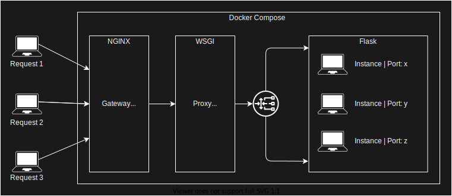

# Título do projeto 
## Visão Geral 
Aqui você deverá descrever os detalhes do seu projeto de um ponto de vista de 

## Gráfico explicativo
  

*Utilizando a extensão de VSCode: Drawio é possível criar um arquivo svg editável apenas utilizando a extensão: ".drawio.svg"

