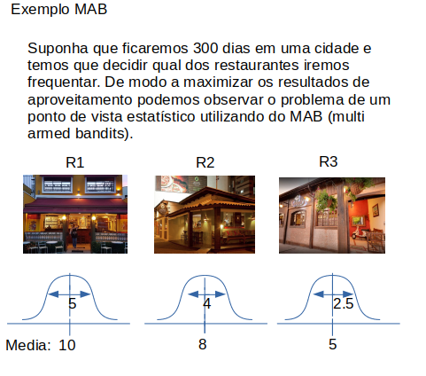
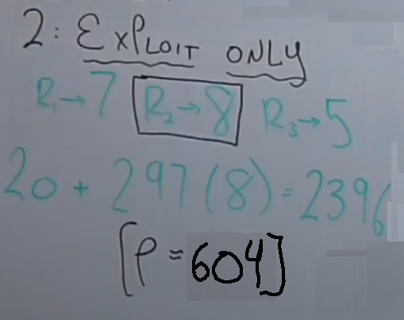

# Título do projeto  
## Visão Geral  
Utilizar de modelos de machine learning para criar perfis de compradores, através dos dados cadastrados, para recomendar de forma mais eficiente descontos personalizados. Por meio de clusterização K-means combinada com MaB (multi-armed bandits), visto que este modelo é ideal quando se depara repetidamente com uma escolha entre k diferentes opções ou ações que devem ser tomadas, após cada escolha, recebe-se uma recompensa numérica que está ligada a sua escolha e que pode influenciar suas escolhas futuras. O objetivo é maximizar a recompensa total esperada ao longo do tempo ao fazer escolhas certas. De forma traduzida em um Sistema de Recomendação, onde, repetidamente teremos que escolher o conteúdo que será apresentado para o usuário (ações), cada conteúdo tem uma distribuição de probabilidade de ser clicado (recompensa) e o objetivo do sistema de recomendação é maximizar a taxa de eventos no final do dia (maximizar a recompensa). Em quesito do projeto, o MaB será usado para modelar o perfil do consumidor, este considera cada braço como recompensa, e cada recompensa como uma oferta, além de função de ganho customizada definida a fim de alcançar tanto o desconto personalizado quanto a métrica de conquistas do sistema.

[Link da Apresentação do Projeto](https://github.com/marcusng8/Discount-Leverage/blob/main/readme/ApresentaçãoFinalPrototipação_DiscountLeverage.pdf)

### Problema  
-Para quem conceder desconto?

-Como saber se o desconto foi aproveitado?

-Como saber qual desconto terá retorno positivo?

### Proposta de solução  
 Desenvolver sistema que aprende o padrão de compra da POC, cria um modelo do perfil de usuário e a partir dos dados, gera suposições desse padrão de compra, e define, segundo esses padrões, qual evento de desconto trará maior recompensa á Ambev e qual será mais atrativa ao cliente. 
 De maneira geral, o sistema aprende atraves de recompensas se um certo desconto sera mais bem utilizado.

# Informações Técnicas
## Gráfico explicativo  
  

  
Atraves desses dados podemos inferir que o melhor valor de aproveitamento seria sempre ir no restaurante numero 1, pois este possui a maior media.

Temos portanto a melhor taxa como o numero de dias (300) multiplicado pela melhor media (10)

Obtendo Mo = 3000


O metodo de exploração simplesmente seria dividir o tempo total entre os tres restaurantes, podemos observar que não é o melhor metodo no momento que esta longe da melhor faixa com uma diferença de 700.

  
O metodo de exploitation(abuso) tem um resultado melhor que o metodo de apenas exploração, porem ele tem o grave problema de so ter um ajuste inicial, podendo assim cair em um restaurante com uma media ruim e gerar uma valor muito pior que o de exploração. No exemplo percebemos o segundo restaurante, em momento inicial, como superior e por isso continuamos indo nele durante nossa estadia. Temos uma faixa com diferença de aproximadamente 600 ao inves do 700 do de exploração apenas. Um resultado certamente superior, porem ainda esta longe do melhor.


O resultado do metodo misto, utiliza de umas porcentangem do periodo total de estadia para testar os restaurante, e apos esse periodo de teste ele passa apenas a ir no restaurante de melhor perfomance. Teriamos aqui portanto, com a porcentagem sendo 10% do total de estadia, r1(10 * 10) + r2(10 * 8) + r3(10 * 5) => r1(100) + r2(80) + r3(60) => 240 + 270(10) = 240 + 2700 => 2960
Gerando assim um resultado de aproveitamento de 2960, uma diferenca extrema em relação aos metodos não flexiveis, com uma faixa de diferenca de aproximadamente 40 apenas.


## Pré requisitos
- Sistema Operacional  
- Linguagem Utilizada

   Python

- Ambiente virtual

     Google Collab (notebook)
 
- Bibliotecas

(Biblioteca os, sys, csv, json, io)
    tratamento de data set de entrada.

(Biblioteca pandas) 
    leitura do dados

(Biblioteca matplotlib.pyplot, seaborn) 
    para demonstrar dados graficamente

(Biblioteca numpy) 
    tratamento de dados numéricos

(Biblioteca utils) 
    ferramentas gerais para auxilio no funcionamento das diversas técnicas embutidas
    
(from sklearn.model_selection import ShuffleSplit
from sklearn.cluster import KMeans
from sklearn.metrics import silhouette_samples, silhouette_score) Bibliotecas necessária para aplicar técnicas de processamento de sinal afim de tratar os dados

(Biblioteca pickle) salvar resultado das técnicas para usos futuros

## Processo de instalação e execução

Para poder testar o codigo no GoogleCollab sera necessario a base dados da ambev com a adição de duas colunas novas nomeadas de visit_count e Purchase_count, que respectivamente falam sobre o numero de visitas, e o numero de compras de um certo ID. Ambos os valores podem ser acrescentados de maneira aleatoria, recomendamos utilizar de valores de 1 a 100 para facilitar o processo. 

Dentro do codigo no ambiente virtual do google collab, clique em files e preencha com o conteudo de cada uma das pasta presentes no projeto.


Deve-se clicar no icone da pasta.


No momento que for aberto, deve-se carregar os arquivos afim de ficar igual a proxima imagem.


A arvore do respositório fica organizado da seguinte forma 


```
├───data
├───scripts
└───sources
    ├───funk_svd
    ├───mab    
```
Ao rodar o código, este perdirá para você fazer upload (de seu computador) da base de dados "RandomVisitBuyingCount.csv" presente neste repositório, e, posteriormente, da "Data.csv", correspondente á base de dados disopnibilizada pela Ambev.

# Time

| [<br><sub>@Juliagontijo</sub>](https://github.com/juliagontijo) | [<br><sub>@Marcusng8</sub>](https://github.com/marcusng8) | [<br><sub>@RodrigoOliveira</sub>](https://github.com/rodrigogitrep) | 
| :---: | :---: | :---: |
